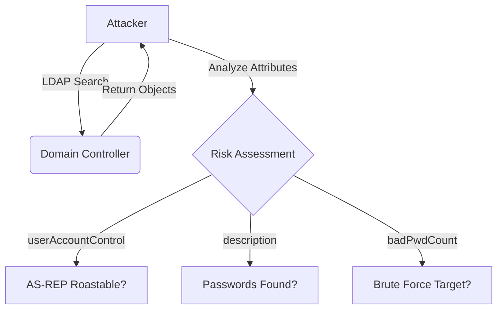
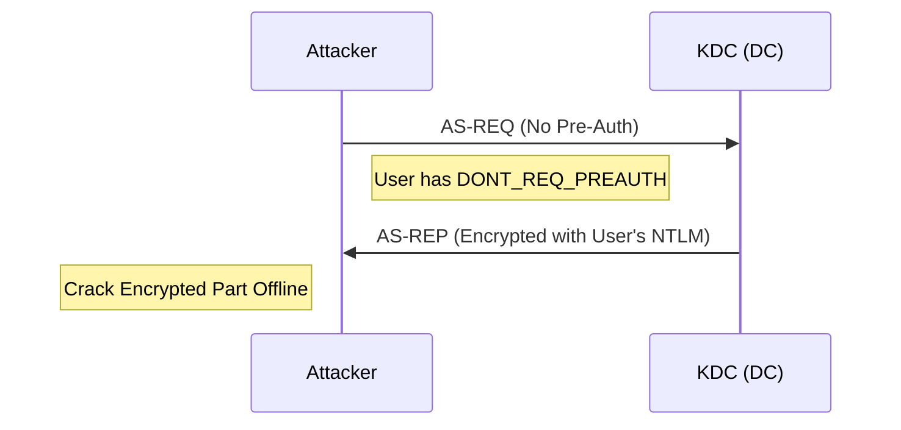
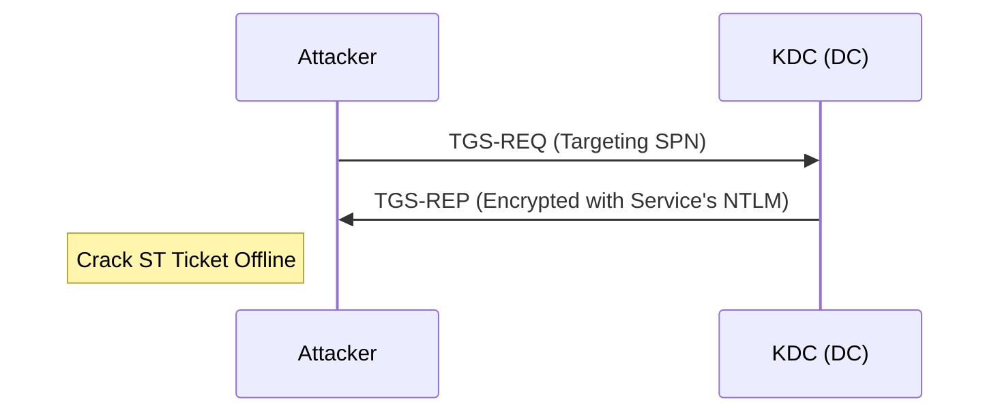
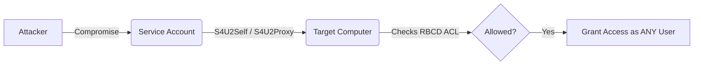
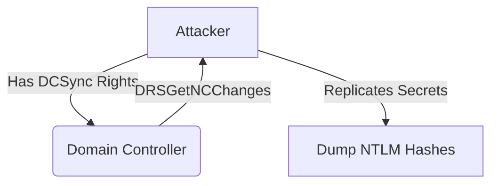

# RedReason Technical Tutorial

This document explains the technical implementation of **RedReason**'s capabilities, covering Enumeration, Vulnerability Checks, and Attack Vectors. It includes code snippets demonstrating how these are executed programmatically using `impacket` and `ldap3`.

---

# Part 1: Enumeration

## 1. User Enumeration (Detailed)
**Concept**: Enumerating users goes beyond just listing names. We analyze attributes to assess risk, including `userAccountControl` (UAC) flags, password age, and potential secrets in descriptions.



**Code Snippet (`modules/ad_enum.py`)**:
```python
def get_users_detailed(self):
    # Search for all person objects
    search_filter = "(&(objectClass=user)(objectCategory=person))"
    # Key Attributes:
    # - description: Often contains default passwords.
    # - pwdLastSet: Calculate password age.
    # - badPwdCount: Identify brute-force attempts.
    # - userAccountControl: Bitmask for account status (Disabled, Locked, No-PreAuth).
    attributes = ['sAMAccountName', 'description', 'pwdLastSet', 'badPwdCount', 'userAccountControl', 'adminCount']
    
    self.conn.search(self.conn.server.info.other['defaultNamingContext'][0], search_filter, attributes=attributes)
    
    for entry in self.conn.entries:
        # Check UAC Flags
        uac = entry.userAccountControl
        if uac and (uac & 0x00040000): # DONT_REQ_PREAUTH
            print(f"VULNERABLE: {entry.sAMAccountName} (AS-REP Roastable)")
```

## 2. Blind User Enumeration (No Credentials)
**Concept**: If we lack credentials, we can't use LDAP. However, we can use the Kerberos protocol (Port 88) to verify if a user exists. If we ask for a TGT without Pre-Authentication, the KDC responds differently based on whether the user exists, doesn't exist, or requires Pre-Auth.

**Code Snippet (`modules/ad_enum.py`)**:
```python
def verify_user_kerberos(self):
    # Request TGT with NO Pre-Auth
    clientName = Principal(self.user, type=constants.PrincipalNameType.NT_PRINCIPAL.value)
    tgt, cipher, _, _ = getKerberosTGT(clientName, '', self.domain, None, None, no_preauth=True)
    
    # Outcomes:
    # 1. TGT Received -> User Exists AND is AS-REP Roastable!
    # 2. KDC_ERR_PREAUTH_REQUIRED -> User Exists (Standard security).
    # 3. KDC_ERR_C_PRINCIPAL_UNKNOWN -> User Does Not Exist.
```

## 3. Group Membership (High-Value Targets)
**Concept**: Identifies members of high-privilege groups. Beyond "Domain Admins", we check "Remote Desktop Users" (lateral movement), "Backup Operators" (file access), etc.

**Code Snippet**:
```python
def get_group_members(self):
    groups = ["Domain Admins", "Enterprise Admins", "Schema Admins", "Backup Operators", "Server Operators", "Account Operators"]
    for group in groups:
        # Search for group by CN and list 'member' attribute
        self.conn.search(default_nc, f"(&(objectClass=group)(cn={group}))", attributes=['member'])
```

## 4. Domain Password Policy
**Concept**: Reads the root domain object for password complexity rules to assess brute-force feasibility.

**Attributes Checked**:
-   `minPwdLength`
-   `pwdProperties` (Complexity on/off)
-   `lockoutThreshold` (Account lockout limit)

## 5. Domain Trusts
**Concept**: Maps relationships with other domains (Inbound/Outbound) to identify lateral movement paths between forests.

**Code Snippet**:
```python
def get_domain_trusts(self):
    # Class 'trustedDomain' holds trust info
    self.conn.search(default_nc, "(objectClass=trustedDomain)", attributes=['flatName', 'trustDirection', 'trustAttributes'])
```

---

# Part 2: Vulnerability & Hygiene Checks

## 1. LAPS (Local Admin Password Solution)
**Concept**: Checks if the LAPS attribute `ms-Mcs-AdmPwd` is readable. If configured incorrectly, regular users might be able to read local admin passwords of computers.

**Code Snippet**:
```python
def check_laps(self):
    # Search computers with the LAPS attribute visible
    self.conn.search(default_nc, "(&(objectClass=computer)(ms-Mcs-AdmPwd=*))", attributes=['dNSHostName', 'ms-Mcs-AdmPwd'])
```

## 2. AD CS (Active Directory Certificate Services)
**Concept**: Enumerates Certificate Authorities and Templates. Unsecured templates (ESC1) or HTTP enrollment endpoints (ESC8) allow privilege escalation or NTLM relaying.

**Code Snippet (`modules/ad_enum.py`)**:
```python
def check_adcs_templates(self):
    # Search Configuration Partition for pKICertificateTemplate
    self.conn.search(config_nc, "(objectClass=pKICertificateTemplate)", attributes=['msPKI-Certificate-Name-Flag', ...])
    
    # Check for ESC1:
    # 1. Enrollee Supplies Subject (0x00000001)
    # 2. Client Authentication EKU
    # 3. No Manager Approval
```

## 3. Service Account Risks (Hygiene)
**Concept**: Identifies service accounts (with SPNs) that are also members of Admin groups ("Shadow Admins"). Also checks for stale passwords (> 1 year).

**Code Snippet**:
```python
def check_service_account_risks(self):
    # Find admins (from group enum) and check if they have 'servicePrincipalName'
    # High Risk: Admin Service Account = Kerberoastable Admin!
```

## 4. Legacy Protocols (RC4)
**Concept**: Identifies accounts capable of only RC4 encryption, which is weaker and implies older systems.

**Code Snippet**:
```python
def check_kerberos_encryption_types(self):
    # msDS-SupportedEncryptionTypes attribute
    # If missing or set to 0/4 (RC4 only), it's legacy.
```

## 5. AdminSDHolder
**Concept**: Checks the ACL of the `AdminSDHolder` object. This object's permissions are applied to all protected groups (Domain Admins, etc.) every hour. Attackers add themselves here for persistence.

## 6. Machine Account Quota (MAQ)
**Concept**: Checks `ms-DS-MachineAccountQuota`. If > 0 (default 10), any user can create computer accounts, facilitating RBCD and Shadow Credentials attacks.

---

# Part 3: Attack Vectors

## 1. AS-REP Roasting
**Concept**: Users with `DONT_REQ_PREAUTH` allow any attacker to request a TGT and crack the session key offline.



**Target**: `userAccountControl:1.2.840.113556.1.4.803:=4194304`

## 2. Kerberoasting
**Concept**: Any user can request a TGS for a service account (SPN). The ticket is encrypted with the service account's NTLM hash.



**Target**: `(&(objectClass=user)(servicePrincipalName=*))`

## 3. Delegation Abuse
-   **Unconstrained**: Computer trusts meant to store TGTs.
    -   Target: `userAccountControl` bit `TRUSTED_FOR_DELEGATION`.
-   **Constrained**: `msDS-AllowedToDelegateTo`.
-   **RBCD**: `msDS-AllowedToActOnBehalfOfOtherIdentity`.



## 4. GPP Password Hunting
**Concept**: Decrypts `cpassword` fields found in XML files (Groups.xml, etc.) in SYSVOL using the static Microsoft AES key.

## 5. SMB Signing Checks
**Concept**: Checks if SMB Signing is *disabled* on the target (usually safe on DCs, but check anyway). If disabled, enables NTLM Relaying.

## 6. DCSync Rights (ACL Abuse)
**Concept**: Identifies principals with `DS-Replication-Get-Changes` rights on the Domain Root, effectively making them Shadow Domain Controllers.



**Code Snippet**:
```python
def check_dcsync_rights(self):
    # Parsing nTSecurityDescriptor for GUIDs:
    # 1131f6aa-9c07-11d1-f79f-00c04fc2dcd2 (Get Changes)
    # 1131f6ad-9c07-11d1-f79f-00c04fc2dcd2 (Get Changes All)
```

## 7. Coercion Primitives
**Concept**: Checks for services that can be forced to authenticate to an attacker machine (for Relay/RBCD).
-   **PetitPotam**: Exposed `EFSRPC` named pipe.
-   **PrinterBug**: Running Print Spooler service (`spoolss`).
